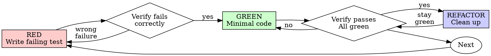

<required>
*CRITICAL* Add the following steps to your Todo list using TodoWrite:

1. Write a failing test (RED phase)
2. Verify the test fails due to the behavior of the application, and NOT due to the test.
   <system-reminder>If you have more than one test that you need to write, you should write all of them before moving to the GREEN phase.</system-reminder>
3. Write the minimal amount of code necessary to make the test pass (GREEN phase)
4. Verify the test now passes due to the behavior of the application.
5. Refactor the code to clean it up.
6. Verify tests still pass.
   </required>

# Red-Green-Refactor In Depth



# Test Writing Guidelines

- Always test real behavior.
- Do not write tests that are just mocks.
- Do not write tests that test implementation detail.
- Do not write tests that just test data structure format.
- Do not write tests that test types.
- Focus on writing tests for integration boundaries.
- Only unit test utilities. Production code must be end to end tested.

## RED - Write Failing Test

Write one minimal test showing what should happen.

<good-example>

```typescript
test("retries failed operations 3 times", async () => {
  let attempts = 0;
  const operation = () => {
    attempts++;
    if (attempts < 3) throw new Error("fail");
    return "success";
  };

  const result = await foobar.retryOperation(operation);

  expect(result).toBe("success");
  expect(attempts).toBe(3);
});
```

Clear name, tests real behavior, one thing. Note that the tested operation is
imported -- this is a STRONG sign that this is testing something real.

</good-example>

<bad-example>

```typescript
test("retry works", async () => {
  const mock = jest
    .fn()
    .mockRejectedValueOnce(new Error())
    .mockRejectedValueOnce(new Error())
    .mockResolvedValueOnce("success");
  await retryOperation(mock);
  expect(mock).toHaveBeenCalledTimes(3);
});
```

Vague name, tests mock not code
</bad-example>

## Verify RED - Watch It Fail

**MANDATORY. Never skip.**

```bash
npm test path/to/test.test.ts
```

Confirm:

- Test fails (not errors)
- Failure message is expected
- Fails because feature missing (not typos)

**Test passes?** You're testing existing behavior. Fix test.

**Test errors?** Fix error, re-run until it fails correctly.

## GREEN - Minimal Code

Write simplest code to pass the test.

<good-example>
```typescript
async function retryOperation<T>(fn: () => Promise<T>): Promise<T> {
  for (let i = 0; i < 3; i++) {
    try {
      return await fn();
    } catch (e) {
      if (i === 2) throw e;
    }
  }
  throw new Error('unreachable');
}
```
Just enough to pass
</good-example>

<bad-example>
```typescript
async function retryOperation<T>(
  fn: () => Promise<T>,
  options?: {
    maxRetries?: number;
    backoff?: 'linear' | 'exponential';
    onRetry?: (attempt: number) => void;
  }
): Promise<T> {
  // YAGNI
}
```
Over-engineered
</bad-example>

Don't add features, refactor other code, or "improve" beyond the test.

## Verify GREEN - Watch It Pass

**MANDATORY.**

```bash
npm test path/to/test.test.ts
```

Confirm:

- Test passes
- Other tests still pass
- Output pristine (no errors, warnings)

**Test fails?** Fix code, not test.

**Other tests fail?** Fix now.

## REFACTOR - Clean Up

After green only:

- Remove duplication
- Improve names
- Extract helpers

Keep tests green. Do not add behavior.

## Common Failure Patterns -- DO NOT DO THESE THINGS

| Excuse                                 | Reality                                                                 |
| -------------------------------------- | ----------------------------------------------------------------------- |
| "Too simple to test"                   | Simple code breaks. Test takes 30 seconds.                              |
| "I'll test after"                      | Tests passing immediately prove nothing.                                |
| "Tests after achieve same goals"       | Tests-after = "what does this do?" Tests-first = "what should this do?" |
| "Already manually tested"              | Ad-hoc ≠ systematic. No record, can't re-run.                           |
| "Deleting X hours is wasteful"         | Sunk cost fallacy. Keeping unverified code is technical debt.           |
| "Keep as reference, write tests first" | You'll adapt it. That's testing after. Delete means delete.             |
| "Need to explore first"                | Fine. Throw away exploration, start with TDD.                           |
| "Test hard = design unclear"           | Listen to test. Hard to test = hard to use.                             |
| "TDD will slow me down"                | TDD faster than debugging. Pragmatic = test-first.                      |
| "Manual test faster"                   | Manual doesn't prove edge cases. You'll re-test every change.           |
| "Existing code has no tests"           | You're improving it. Add tests for existing code.                       |

### RED FLAGS - STOP and Start Over

- Code before test
- Test after implementation
- Test passes immediately
- Can't explain why test failed
- Tests added "later"
- Rationalizing "just this once"
- "I already manually tested it"
- "Tests after achieve the same purpose"
- "It's about spirit not ritual"
- "Keep as reference" or "adapt existing code"
- "Already spent X hours, deleting is wasteful"
- "TDD is dogmatic, I'm being pragmatic"
- "This is different because..."

**All of these mean: Delete code. Start over with TDD.**
